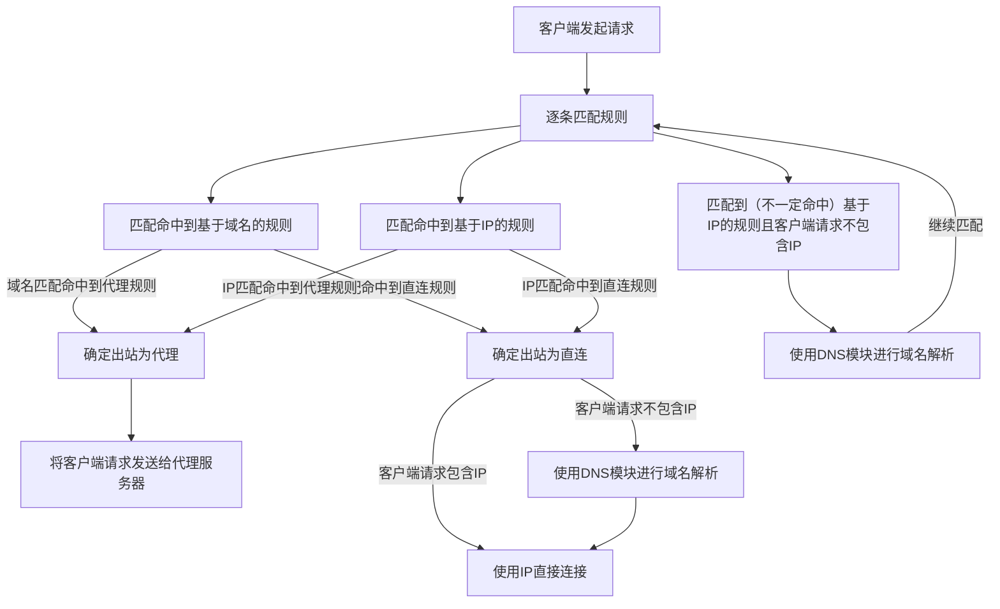
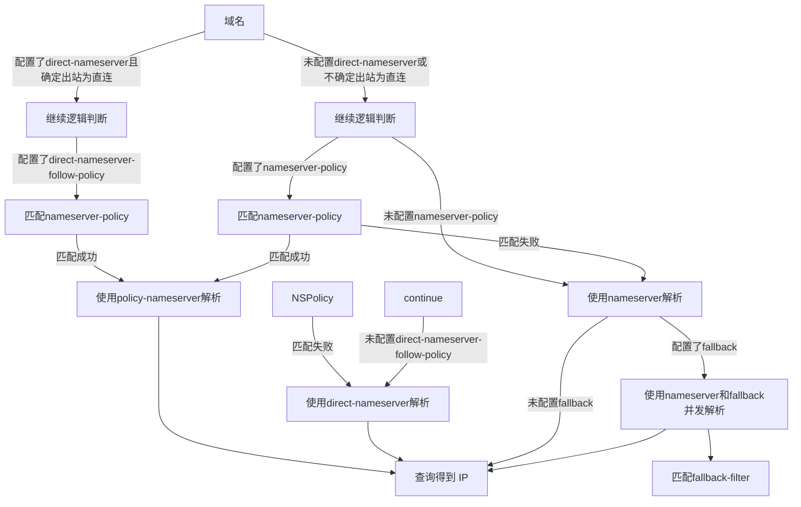

### 路由

```mermaid
flowchart TD
  start[客户端发起请求] --> rule[逐条匹配规则]
  rule --> Domain[匹配命中到基于域名的规则]
  rule --> IP[匹配命中到基于IP的规则]

  Domain --> |域名匹配命中到代理规则|Proxy[确定出站为代理]
  Domain --> |域名匹配命中到直连规则|Direct[确定出站为直连]

  IP --> |IP匹配命中到代理规则|Proxy
  IP --> |IP匹配命中到直连规则|Direct

  Proxy --> Remote[将客户端请求发送给代理服务器]
  Direct --> |客户端请求不包含IP|DNS1[使用DNS模块进行域名解析]
  Direct --> |客户端请求包含IP|Local[使用IP直接连接]
  DNS1 --> Local

  rule --> IPOnDemand[匹配到（不一定命中）基于IP的规则且客户端请求不包含IP]
  IPOnDemand --> DNS2[使用DNS模块进行域名解析]
  DNS2 --> |继续匹配|rule

```

### DNS

```mermaid
flowchart TD
  start[域名] --> |配置了direct-nameserver且确定出站为直连|continue1[继续逻辑判断]
  continue1 --> |配置了direct-nameserver-follow-policy|NSPolicy1[匹配nameserver-policy]
  NSPolicy1 --> |匹配成功|Policy_Lookup[使用policy-nameserver解析]
  Policy_Lookup --> End[查询得到 IP]
  NSPolicy --> |匹配失败|Direct_Lookup
  continue --> |未配置direct-nameserver-follow-policy|Direct_Lookup[使用direct-nameserver解析]
  Direct_Lookup --> End[查询得到 IP]

  start --> |未配置direct-nameserver或不确定出站为直连|continue2[继续逻辑判断]
  continue2 --> |配置了nameserver-policy|NSPolicy2[匹配nameserver-policy]
  continue2 --> |未配置nameserver-policy|Lookup
  NSPolicy2 --> |匹配成功|Policy_Lookup
  NSPolicy2 --> |匹配失败|Lookup[使用nameserver解析]
  Lookup --> |未配置fallback|End
  Lookup --> |配置了fallback|FB_Lookup[使用nameserver和fallback并发解析]
  FB_Lookup --> FB_IP_Match[匹配fallback-filter]
  FB_Lookup --> End

```

