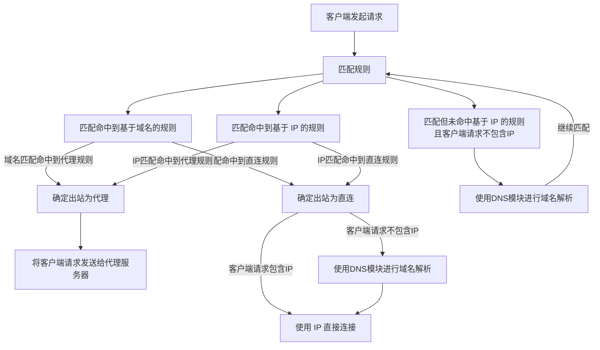
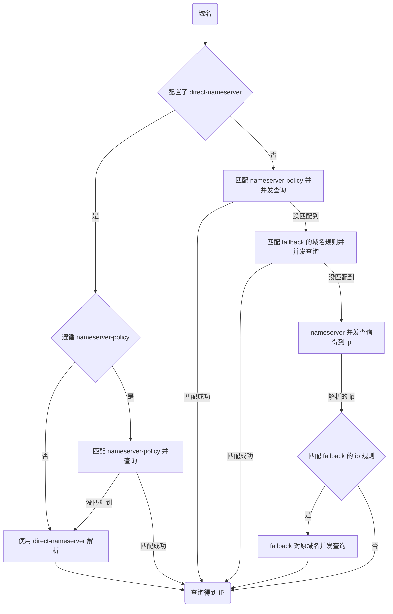

### 路由

```mermaid
flowchart TD
  start[客户端发起请求] --> rule[匹配规则]
  rule --> Domain[匹配命中到基于域名的规则]
  rule --> IP[匹配命中到基于 IP 的规则]
  rule --> IPOnDemand[匹配但未命中基于 IP 的规则且客户端请求不包含IP]

  Domain --> |域名匹配命中到代理规则|Proxy[确定出站为代理]
  Domain --> |域名匹配命中到直连规则|Direct[确定出站为直连]

  IP --> |IP匹配命中到代理规则|Proxy
  IP --> |IP匹配命中到直连规则|Direct

  Proxy --> Remote[将客户端请求发送给代理服务器]
  Direct --> |客户端请求不包含IP|DNS1[使用DNS模块进行域名解析]
  Direct --> |客户端请求包含IP|Local[使用 IP 直接连接]
  DNS1 --> Local

  IPOnDemand --> DNS2[使用DNS模块进行域名解析]
  DNS2 --> |继续匹配|rule

```

### DNS

```mermaid
flowchart TD
  Start(域名) --> DirectResolverValid{配置了 direct-nameserver}

  DirectResolverValid -- 是 --> DirectResolver{遵循 nameserver-policy}
  DirectResolver -- 否 --> DirectResolver_Lookup[使用 direct-nameserver 解析]
  DirectResolver -- 是 --> DirectResolver_NSPolicy[匹配 nameserver-policy 并查询 ]
  DirectResolver_NSPolicy -- 没匹配到 --> DirectResolver_Lookup
  DirectResolver_NSPolicy -- 匹配成功 --> End
  DirectResolver_Lookup --> End

  DirectResolverValid -- 否 --> NSPolicy[匹配 nameserver-policy 并<br>并发查询]
  NSPolicy -- 匹配成功 --> End(查询得到 IP)
  NSPolicy -- 没匹配到 --> FB_DOMAIN[匹配 fallback 的域名规则并<br>并发查询]
  FB_DOMAIN -- 匹配成功 --> End
  FB_DOMAIN -- 没匹配到 --> NS[nameserver 并发查询<br>得到 ip]
  NS -- 解析的 ip --> FB_IP_Match{匹配 fallback 的 ip 规则}
  FB_IP_Match -- 是 --> FB_IP[fallback 对原域名并发查询]
  FB_IP_Match -- 否 --> End
  FB_IP --> End

```

