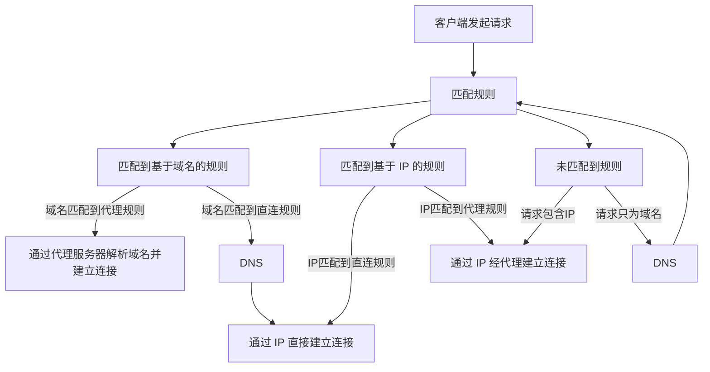
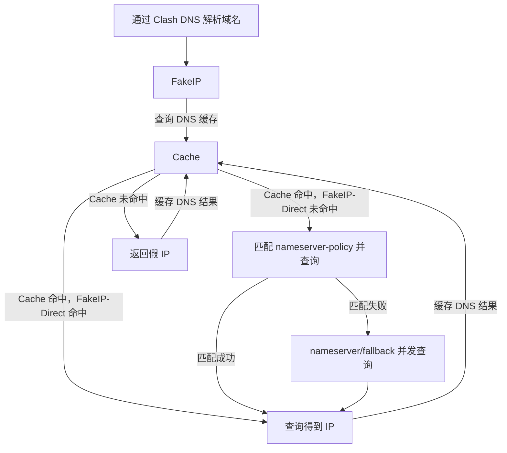

分流：

```mermaid
flowchart TD
  Start[客户端发起请求] --> rule[匹配规则]
  rule --> Domain[匹配到基于域名的规则]
  rule --> IP[匹配到基于 IP 的规则]
  rule --> null[未匹配到规则]

  Domain --> |域名匹配到代理规则|Remote[通过代理服务器解析域名并建立连接]
  Domain --> |域名匹配到直连规则|DNS1[DNS]
  DNS1 --> Direct[通过 IP 直接建立连接]

  IP --> |IP匹配到直连规则|Direct
  IP --> |IP匹配到代理规则|Proxy[通过 IP 经代理建立连接]

  null --> |请求包含IP|Proxy
  null --> |请求只为域名|DNS2[DNS]
  DNS2 --> rule

```

DNS：

```mermaid
flowchart TD
  DNS[通过 Clash DNS 解析域名] --> FakeIP
  FakeIP --> |查询 DNS 缓存|Cache

  Cache --> |Cache 命中，FakeIP-Direct 命中|Get[查询得到 IP]
  Cache --> |Cache 命中，FakeIP-Direct 未命中|NS[匹配 nameserver-policy 并查询 ]
  Cache --> |Cache 未命中|FakeGet[返回假 IP]

  NS --> |匹配成功| Get
  NS --> |匹配失败| NF[nameserver/fallback 并发查询]
  NF --> Get

  Get --> |缓存 DNS 结果|Cache
  FakeGet --> |缓存 DNS 结果|Cache

```

